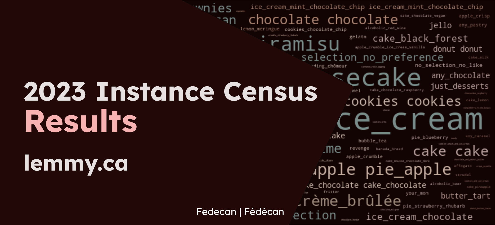
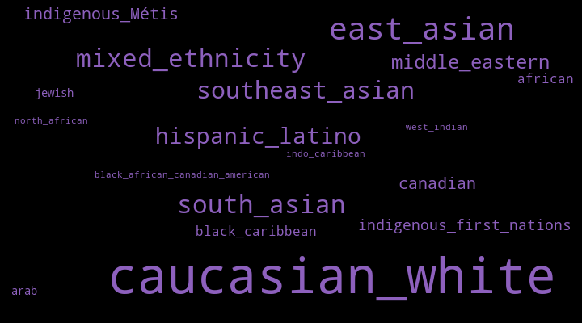
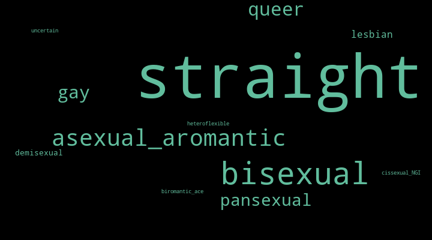

# 2023 Instance Census Results

<figure markdown>
  { .skip-lightbox }
</figure>

This data was [originally shared on Lemmy](https://lemmy.ca/post/15125231), and this blog post has been backdated to match the original post date. This page has improved visualizations that can take advantage of the website format. We hope you enjoy the updated version!

<!-- more -->

!!! warning ""

    **Corrections:**

    - Updated the total response count to 529

!!! tip "Visualizations"
    As we are using DataWrapper for the visualizations, you may want to switch to the light theme for better visibility. You can do this by clicking the sun or moon icons (:material-weather-sunny: / :material-weather-night:), next to the search bar above.

---


Thank you to everyone who took the time to fill out the census! This was an exciting year, and for a lot of users it was their first year on [lemmy.ca](https://lemmy.ca) (and the fediverse in general).

For this census, the questions were more open ended, and it ended up being much harder to do data cleaning and analysis. However, it worked well as the first census because it gave us insight into what we might want to do differently in the future.

The turnout was good, with **529 total responses** in the 1 week that the census was open. That made up around 8% of the ~6500 total users on lemmy.ca, which feels like a nice sample size for some fun analysis.

<br>

To start off, here is a chart of the responses over time:


<div style="width: 90%; margin: auto; padding: 20px; border-radius: 10px; background-color: rgba(61, 61, 55, 0.04); box-shadow: 0 4px 8px rgba(0, 0, 0, 0.1);">
    <div style="min-height:417px"><script type="text/javascript" defer src="https://datawrapper.dwcdn.net/YFnwI/embed.js?v=1" charset="utf-8"></script><noscript></noscript></div>
</div>

This one is pretty self explanatory, so moving on to the actual results!

## Section 1: Where is everyone?

#### **1.1: Where are you from?**

This question was broken down into a few parts. Most users are from Canada:

<div style="width: 90%; margin: auto; padding: 20px; border-radius: 10px; background-color: rgba(61, 61, 55, 0.04); box-shadow: 0 4px 8px rgba(0, 0, 0, 0.1);">
    <div style="min-height:577px"><script type="text/javascript" defer src="https://datawrapper.dwcdn.net/zFfKS/embed.js?v=1" charset="utf-8"></script><noscript></noscript></div>
</div>

Next we can see which province and territories are represented. If we compare to the [population of Canada](https://en.wikipedia.org/wiki/Population_of_Canada_by_province_and_territory), this instance is somewhat consistent with the population distribution with some exceptions (if someone does a proper comparison, please share it! ). We have users from every province and territory, with the exception of Northwest Territories. The [NWT community](https://lemmy.ca/c/nwt) does have subscribers, so hopefully by next year we should have a response from there as well.

<div style="width: 90%; margin: auto; padding: 20px; border-radius: 10px; background-color: rgba(61, 61, 55, 0.04); box-shadow: 0 4px 8px rgba(0, 0, 0, 0.1);">
    <div style="min-height:623px"><script type="text/javascript" defer src="https://datawrapper.dwcdn.net/pi07Y/embed.js?v=1" charset="utf-8"></script><noscript></noscript></div>
</div>

Next we can see where the users from the rest of the world are from:

<div style="width: 90%; margin: auto; padding: 20px; border-radius: 10px; background-color: rgba(61, 61, 55, 0.04); box-shadow: 0 4px 8px rgba(0, 0, 0, 0.1);">
    <div style="min-height:509px"><script type="text/javascript" defer src="https://datawrapper.dwcdn.net/L5Jpf/embed.js?v=1" charset="utf-8"></script><noscript></noscript></div>
</div>

Thanks for spending time on [lemmy.ca](https://lemmy.ca) everyone!

#### **1.2: How big is your community?**

The original question included two options (rural and urban), but a handful of users (13) entered “suburban” as a custom response. That could be something to add in the future.

<div style="width: 90%; margin: auto; padding: 20px; border-radius: 10px; background-color: rgba(61, 61, 55, 0.04); box-shadow: 0 4px 8px rgba(0, 0, 0, 0.1);">
    <div style="min-height:430px"><script type="text/javascript" defer src="https://datawrapper.dwcdn.net/ygmGV/embed.js?v=1" charset="utf-8"></script><noscript></noscript></div>
</div>

However, what’s interesting is that our results are very similar to the proportions reported by [Statistics Canada](https://www150.statcan.gc.ca/n1/daily-quotidien/220209/g-a003-eng.htm) for the 2021 Canadian census. We had 82.8% urban, 14.7% rural, and 2.4% other, while the 2021 Canadian census reported ~82.15% urban and ~17.8% rural ([source](https://www12.statcan.gc.ca/census-recensement/2021/as-sa/98-200-x/2021002/98-200-x2021002-eng.cfm)).

#### **1.3: Quality of internet connection**

<div style="width: 90%; margin: auto; padding: 20px; border-radius: 10px; background-color: rgba(61, 61, 55, 0.04); box-shadow: 0 4px 8px rgba(0, 0, 0, 0.1);">
    <div style="min-height:430px"><script type="text/javascript" defer src="https://datawrapper.dwcdn.net/thZYM/embed.js?v=1" charset="utf-8"></script><noscript></noscript></div>
</div>

To help those that don’t have excellent internet, you can do small things like reducing the size of images before uploading them.

## Section 2: Who are you?

#### **2.1: Age Distribution**

There was a lot of interest in seeing the results for this question:

<div style="width: 90%; margin: auto; padding: 20px; border-radius: 10px; background-color: rgba(61, 61, 55, 0.04); box-shadow: 0 4px 8px rgba(0, 0, 0, 0.1);">
<div style="min-height:418px"><script type="text/javascript" defer src="https://datawrapper.dwcdn.net/1XnIU/embed.js?v=1" charset="utf-8"></script><noscript></noscript></div>
</div>

We can see a nice curve, with a peak around 30-39. So the average age on Lemmy is likely a bit older than other social media platforms, but there’s a good spread nonetheless.

#### **2.2: Ethnicity**

This was one of the questions that I couldn’t analyze the way I was originally planning to. While allowing for multiple responses and user submissions allowed for more accurate self-identified responses, it made it difficult to visualize the data in a meaningful way. This data deserves a more in depth analysis, but for now I opted to create a word cloud so we could get a sense of what the responses were like.

<figure markdown style="width: 90%; margin: auto; padding: 20px; border-radius: 10px; background-color: rgba(61, 61, 55, 0.04); box-shadow: 0 4px 8px rgba(0, 0, 0, 0.1);">
  

  See the note at the bottom on the potential for bias or misleading results.
</figure>

The command that was used for this graphic:

```bash
wordcloud_cli --text text.txt --imagefile wordcloud.png --prefer_horizontal 1 --width 720 --margin 10 --height 400 --colormask colormask.jpeg --random_state 5 --relative_scaling 0.4
```

!!! info "Word Clouds"

    For this question and others that used a word cloud, we used this project to generate the results locally: [:simple-github: amueller/word_cloud](https://github.com/amueller/word_cloud)

### **2.3: Gender identity**

With this question, we can see that a large proportion of users identify as ‘Man’ (441), followed by ‘Woman’ (32), ‘Non-Binary’ (25), ‘Genderfluid’ (3), and the remaining responses were custom responses (1).

<div style="width: 90%; margin: auto; padding: 20px; border-radius: 10px; background-color: rgba(61, 61, 55, 0.04); box-shadow: 0 4px 8px rgba(0, 0, 0, 0.1);">
    <div style="min-height:430px"><script type="text/javascript" defer src="https://datawrapper.dwcdn.net/yYxqy/embed.js?v=1" charset="utf-8"></script><noscript></noscript></div>
</div>

This is something that could use more analysis and comparison as the instance continues to grow.

### **2.4: Trans experience**

The question from the census was "Are you someone with trans experience (meaning your gender identity does not align with your sex assigned at birth)?". In case it is hard to see from the graph, the breakdown was ‘No’ (472 | 93.8%), ‘Yes’ (28 | 5.3%), and the rest of the responses were custom responses (4 | 0.9%).

<div style="width: 90%; margin: auto; padding: 20px; border-radius: 10px; background-color: rgba(61, 61, 55, 0.04); box-shadow: 0 4px 8px rgba(0, 0, 0, 0.1);">
    <div style="min-height:430px"><script type="text/javascript" defer src="https://datawrapper.dwcdn.net/BoL5V/embed.js?v=1" charset="utf-8"></script><noscript></noscript></div>
</div>

You can see Canadian census data for [‘Sex at birth and gender’ here](https://www.statcan.gc.ca/en/census/census-engagement/community-supporter/sex-birth-gender).

### **2.5: How do you identify?**

Similar to the other question above, this question allowed for multiple responses and user submissions, so it was difficult to visualize the data in a meaningful way.

<figure markdown style="width: 90%; margin: auto; padding: 20px; border-radius: 10px; background-color: rgba(61, 61, 55, 0.04); box-shadow: 0 4px 8px rgba(0, 0, 0, 0.1);">
  

  See the note at the bottom on the potential for bias or misleading results.
</figure>

The command that was used for this graphic:

```bash
wordcloud_cli --text text.txt --imagefile wordcloud.png --prefer_horizontal 1 --width 720 --margin 10 --height 400 --colormask colormask.jpeg --random_state 6 --relative_scaling 0.55
```

### **2.6: Disability Status (optional)**

As this was an optional question with free responses and a small number of responses overall, I opted to manually clean the results and list out details from the responses. Hopefully this is still useful while also respecting the privacy of the respondents.

- “ADHD”
- “anxiety”
- “ASD/autism”
- “AuDHD”
- “bipolar disorder”
- "BPD"
- “colorblind (protanomaly)”
- “depression”
- “difficulty processing information”
- “fibromyalgia”
- “health decline due to age/life experiences”
- “learning disability”
- “neurodivergence”
- “partial deafness”
- “PTSD”
- “sensory issues”
- “struggles with mental health”
- “vascular Ehlers-Danlos syndrome”

### **2.7: Educational Background**

For this question, multiselect really didn’t make sense. Some users included everything, and others picked their highest level of education. Instead, I manually cleaned all the results to answer “What is your highest level of education?”. Other details that aren’t captured in the graph include entries that highlighted that the program was in progress, or that they dropped out. With that in mind, I had to make some choices about how to clean the data, and my choices may not reflect the original intent of the respondents.

Next time should be better, as we can split this into a few questions:

- Highest level of education achieved
- School is in progress?

We could keep the multiselect option since ‘highest level of education’ doesn’t get the full picture. We could also add “CÉGEP diploma”, “College diploma”, and “Other degree/diploma” as options.

<div style="width: 90%; margin: auto; padding: 20px; border-radius: 10px; background-color: rgba(61, 61, 55, 0.04); box-shadow: 0 4px 8px rgba(0, 0, 0, 0.1);">
    <div style="min-height:449px"><script type="text/javascript" defer src="https://datawrapper.dwcdn.net/rjUbe/embed.js?v=1" charset="utf-8"></script><noscript></noscript></div>
</div>

Here are the raw counts for each of the original options:

<div style="width: 90%; margin: auto; padding: 20px; border-radius: 10px; background-color: rgba(61, 61, 55, 0.04); box-shadow: 0 4px 8px rgba(0, 0, 0, 0.1);">
    <div style="min-height:327px"><script type="text/javascript" defer src="https://datawrapper.dwcdn.net/lI7xx/embed.js?v=1" charset="utf-8"></script><noscript></noscript></div>
</div>

### **2.8: Employment Status**

We got a few custom responses, including ‘active duty military’, ‘disability’, etc. Those were included in the ‘other’ category, and we could add those options in the future.


<div style="width: 90%; margin: auto; padding: 20px; border-radius: 10px; background-color: rgba(61, 61, 55, 0.04); box-shadow: 0 4px 8px rgba(0, 0, 0, 0.1);">
    <div style="min-height:346px"><script type="text/javascript" defer src="https://datawrapper.dwcdn.net/7m42i/embed.js?v=1" charset="utf-8"></script><noscript></noscript></div>
</div>

The percentages are as follows:

- Employed Full-time: ~70.8%
- Employed Part-time: ~4.8%
- Self-Employed: ~7.1%
- Unemployed: ~6.7%
- Student: ~6.7%
- Homemaker: ~0.4%
- Retired: ~2.5%
- Other: ~1.0%

### **2.9: Field of Work**

This question was… a mess to try and clean and display. I tried to collapse as many similar responses as I could, but it felt like I was making more mistakes than I was fixing:

<figure markdown style="width: 90%; margin: auto; padding: 20px; border-radius: 10px; background-color: rgba(61, 61, 55, 0.04); box-shadow: 0 4px 8px rgba(0, 0, 0, 0.1);">
  

  See the note at the bottom on the potential for bias or misleading results.
</figure>

The command that was used for this graphic:

```bash
wordcloud_cli --text text.txt --imagefile wordcloud.png --prefer_horizontal 1 --width 720 --margin 10 --height 400 --colormask colormask.jpeg --random_state 150 --relative_scaling 0.35
```

## Section 3: Instance Usage

### **3.1: Number of Communities**


